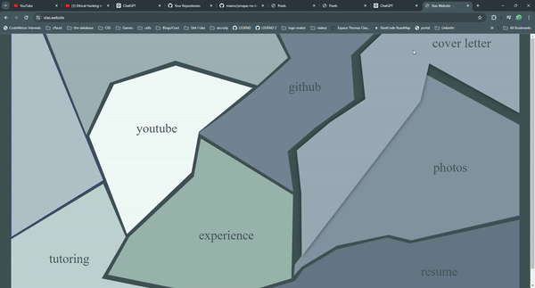

# Porque No Los Dos / Why not both?
## SVG / HTML To Canvas <--> and vice versa


## Back Story:

Say you need to make something like a knowledge graph ...


### Do you use HTML Canvas or do use use SVG ?


- SVG allows you to have on-hover, css styling, and makes the web based interaction a breeze 
- Its easier to do graph positions & math with Canvas 
- SVG starts to suffer after thousands of elements while canvas doesn't mind at all 


This question was always on my mind, until one day, at yoga, it hit me 


WHY NOT BOTH? 


## How It Works:


1) Start with an HTML or SVG page, whatever floats your boat man.
 Just make sure to wrap everything in these two html tags :)

 ```html

 <div id='container'>
    <div id='content'>
        <!-- whatever you want goes here -->
    </div>
</div>
 ```

2) Intercept whatever action you'd like and call this function

```JavaScript
MapBuilder.build(
    content
).then(map => {
})    
```

This will take your html or your svg, and convert it to a map of pixel values, with each cell containing information pertaining to the color value at it's x & y position

```json
{x: 0, y: 0, color: 'rgba(0,128,0,1)'}
```

3) Render the cells a canvas and remove the original html element 

```javascript
let animation = new Animation(container, map, 10, 255)
animation.particleSwarm(function() { cs("DONE"); })
```

Now you can run whatever physics based animation you'd like, and when the animation is done executing, you can invoke whatever callback function you'd like!
